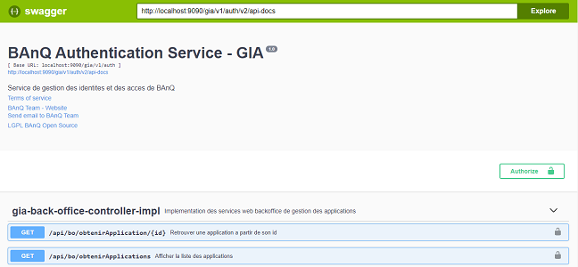
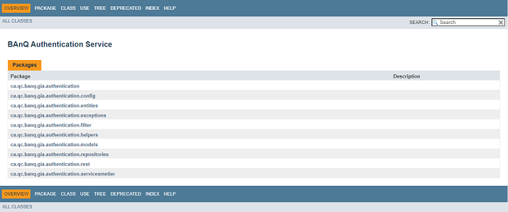
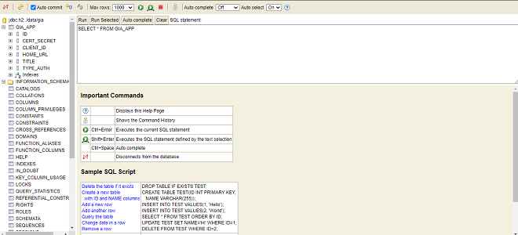

## Table of Contents

* [Description](#Description)
* [Dependances](#Dependances)
* [Installation](#installation)
* [What's included](#whats-included)
* [Comments](#Comments)
* [Convention de Codage](#Nomenclature)
* [Documentation](#documentation)
* [Contributing](#contributing)
* [Versioning](#versioning)
* [Creators](#creators)
* [Copyright and license](#license)
* [Support IDEL Development](#support-development)


## Description
Le module banq-authentication-service.
- Déploiement sous forme de micro-service

Il s'agit d'un programme java 11 développé avec le framework Spring Boot 2.4.3


## Dependances

* 💪  [Java 17](https://www.java.com/)
* 💪  [maven-3.6.2](https://maven.apache.org/)
* 💪  [Spring Boot 2.6.6](https://spring.io/projects/spring-boot)
* 💪  [Hibernate 5.3.3](https://hibernate.org/)
* 💪  [Tomcat 9](http://tomcat.apache.org/)
* 💪  [Swagger-UI 2.9.2](https://swagger.io/tools/swagger-ui/)
* 💪  [Lombok 1.18](https://projectlombok.org/)
* 💪  [H2 Database](https://www.h2database.com/html/main.html)
* 💪  [Sonarlint]


## Installation

- Installer Java JDK17
- Installer Maven
- Installer sts (Spring Tool Suite) ou Intellij
- Installer les sources :

```bash
git clone https://djiomoufrancis@bitbucket.org/banq-dgtit/api-service-authentification.git
cd api-service-authentification
mvn -e clean package
```


## What's included

```
api-service-authentification/
├── src/
│   ├── main/
│   │   ├── java/
│   │   │   ├── ca.qc.banq.gia.authentication/
│   │   │   ├── ca.qc.banq.gia.authentication.config/
│   │   │   └── ca.qc.banq.gia.authentication.controller/
│   │   │   ├── ca.qc.banq.gia.authentication.entities/
│   │   │   ├── ca.qc.banq.gia.authentication.exceptions/
│   │   │   ├── ca.qc.banq.gia.authentication.filter/
│   │   │   ├── ca.qc.banq.gia.authentication.helpers/
│   │   │   ├── ca.qc.banq.gia.authentication.mapper/
│   │   │   ├── ca.qc.banq.gia.authentication.models/
│   │   │   ├── ca.qc.banq.gia.authentication.repositories/
│   │   │   ├── ca.qc.banq.gia.authentication.services/
│   │   ├── resources/
│   │   │   ├── config/
│   │   │   ├── docs/
│   │   │   ├── i18n/
│   │   │   └── application.properties
│   ├── test/
│   │   ├── java/
│   │   │   ├── ca.qc.banq.gia.authentication/
│   │   │   ├── ca.qc.banq.gia.authentication.controller/
│   │   │   ├── ca.qc.banq.gia.authentication.mapper/
│   │   │   ├── ca.qc.banq.gia.authentication.repositories/
│   │   │   ├── ca.qc.banq.gia.authentication.services/
│   │   ├── resources/
│   │   │   └── application-test.yml
├── .gitignore
├── README.md
└── pom.xml
```


## Comments

- Package **ca.qc.banq.gia.authentication:** Package de base contenant la classe de demarrage de l'application
- Package **ca.qc.banq.gia.authentication.helpers:** Contient les objets partages par tous les composants de
  l'application
- Package **ca.qc.banq.gia.authentication.config:** Contient les differentes configurations
- Package **ca.qc.banq.gia.authentication.exception:** Contient les Exceptions
- Package **ca.qc.banq.gia.authentication.services:** Couche des traitements métier
- Package **ca.qc.banq.gia.authentication.entities:** Couche des entités du modèle de données
- Package **ca.qc.banq.gia.authentication.models:** Couche des modèles de données
- Package **ca.qc.banq.gia.authentication.controller:** Couche des webservices rest
- Package **ca.qc.banq.gia.authentication.mapper:** Couche de transformation DTO to Entity or Entity to DTO
- Package **ca.qc.banq.gia.authentication.repositories:** Couche pour operation sur les Entity
- ressource **config** Contient les differents profils de configuration
- ressource **docs** Contient les ressources representant la documentation des API et la documentation des sources du
  projet
- ressource **i18n** Contient les fichiers de messages utilises pour l'internationalisation
- ressource **application.properties** Fichier de configuration de base de l'application

**Differentes configurations de l'application**:  
		+ *AppConfig.java* : Configuration globale de l'application  
		+ *SwaggerConfig.java* : Configuration de la documentation Swagger  
		+ *WebMvcConfig.java* : Configuration MVC  
		+ *SecurityConfig.java* : Configuration de la securite d'acces a l'application  

```
| No | Package       | Description                                            |
|----|:-------------:|-------------------------------------------------------:|
|  1 | helpers       | utilitaires partagés                                   |
|  2 | config        | configurations du module                               |
|  3 | exception     | Les Exceptions                                         |
|  4 | models        | Les DTO                                                |
|  5 | service 		 | Les traitements métier                                 |
|  6 | controller    | Webservices Rest                                       |
```

## Convention de Codage

- Les classes utilisent la convention de nommage standard dite de «**Camel Case**» (premiere letre de chaque mot en majuscule)
- Une classe qui implémente une interface se termine par «**Impl**»
- Les classes de type controlleurs contiennent le mot clé «**Controller**»
- Les Référentiels d'entités sont des interfaces se terminant par le mot clé «**Repository**»
- Les interfaces de services métier se terminent par le mot clé «**Service**»
- Les classes de configuration se terminent par le mot «**Config**»


## Documentation
#### API & Javadoc
The documentation for the banq-authentication-service is hosted at :
- » API Documentation : <http://localhost:9090/gia/v1/auth/apidoc/index.html>
  
- » Javadoc : <http://localhost:9090/gia/v1/auth/docs/javadoc/index.html>
  
- » Base de données H2 Embedded : <http://localhost:9090/gia/v1/auth/h2-console>
  
```
| No | Intitule                        | Valeur                  |
|----|:-------------------------------:|------------------------:|
|  1 | utilisateur de base de données  | sa                      |
|  2 | mot de passe de base de données | UEA1NXcwckQ=            |
|  3 | Datasource Url                  | jdbc:h2:mem:gia      	 |
```


## Tests
Deux application ont été configurées par défaut "**msal-b2c-web-sample**" pour une authentification Azure B2C et accessible via l'url
<http://localhost:9090/gia/v1/auth?appid=1>
ou encore l'application "**msal-web-sample**" pour tester une authentification Azure Active Directory et accessible via l'url
<http://localhost:9090/gia/v1/auth?appid=1>

	
## Le Build :

```bash
	cd api-service-authentification/
	mvn -e clean package
```
 
#### Pré-requis
 
* Disposer d'un Serveur Linux au noyau RedHat
* Fichier banq-authentication-service.jar (généré dans le répertoire target/ après le build du projet)
* Avoir installé Java sur le serveur (ex: alternative par défaut sur /usr/bin/java)
 
#### Copier les ressources sur le serveur
- Accéder au serveur	
- Créer le *WorkingDirectory* de l'application banq-authentication-service (ex: /opt/gia)

```bash
  sudo mkdir /opt/gia/
```
- Copier les ressources a déployer (banq-authentication-service.jar et répertoire config) dans le *WorkingDirectory*

```
  cp banq-authentication-service.jar /opt/gia/
```

#### Créer le service banq-authentication.service  
Ceci est nécessaire au premier déploiement et permet de démarrer les service automatiquement par l'OS au démarrage du système

```
vim /etc/systemd/system/banq-authentication.service
```

- ajouter le contenu suivant au fichier

```
[Unit]
Description=BAnQ Authentification Service
Requires=network.service
After=network.service

[Service]
WorkingDirectory=/opt/gia
ExecStart=$JAVA_HOME/bin/java -jar /opt/gia/banq-authentication-service.jar
SuccessExitStatus=143

[Install]
WantedBy=multi-user.target
```

- Sauvegarder et fermer le fichier

```
[Echap]
:wq!
[Enter]
```

- Activer le service

```
sudo systemctl enable banq-authentication.service
```
 
#### Démarrer le service
```
sudo systemctl start banq-authentication.service
```
 
#### Redémarrer le service
Cette action sera généralement indispensab;e en cas de mise a jour de l'application (ex: modification d'un fichier de configuration ou déploiement d'une nouvelle version du fichier jar).
Executer la commande suivante :
```
sudo systemctl restart banq-authentication.service
```
 
#### Arrêter le service
```
sudo systemctl stop banq-authentication.service
```
 
#### Vérifier le statut du service
```
sudo systemctl status banq-authentication.service
```
 
#### Consulter en temps réel les logs du service
```
tail -lf /opt/gia/logs/banq-authentication.log
```


## Contributing

Please read through our [contributing guidelines] opening issues, coding standards, and notes on development.
http://jira.banq.qc.ca


## Versioning

For transparency into our release cycle and in striving to maintain backward compatibility, banq-authentication-service is maintained under http://nexus.banq.qc.ca/repository/maven-group/


## Creators

**BAnQ**

* <http://www.banq.qc.ca/accueil/>


## Copyright and license

copyright 2020 BAnQ.


## Support Development

banq-authentication-service is an BAnQ licensed open source project. However, the amount of effort needed to maintain and develop new features for the project is not sustainable without proper financial backing.
